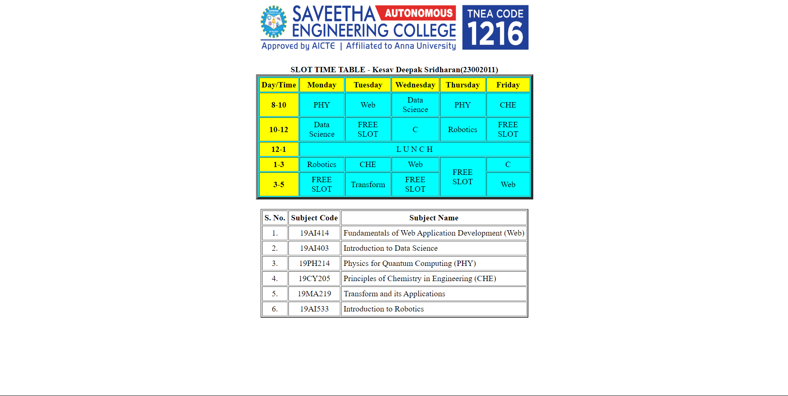

# Ex03 Time Table
## Date:

## AIM
To write a html webpage page to display your slot timetable.

## ALGORITHM
### STEP 1
Create a Django-admin Interface.

### STEP 2
Create a static folder and inert HTML code.

### STEP 3
Create a simple table using ```<table>``` tag in html.

### STEP 4
Add header row using ```<th>``` tag.

### STEP 5
Add your timetable using ```<td>``` tag.

### STEP 6
Execute the program using runserver command.

## PROGRAM
```python 
<!DOCTYPE html>
<html lang="en">
<head>
<title>Slot Timetable</title>
</head>
<body>
<center>

</center>
<br>
<table align="center" width="540" cellspacing="2" cellpadding="4" border="5" bgcolor="cyan">
<caption><b>SLOT TIME TABLE - Kesav Deepak Sridharan(23002011)</b></caption>
<tr align="center">
<th bgcolor="yellow">Day/Time</th>
<th bgcolor="yellow">Monday</th>
<th bgcolor="yellow">Tuesday</th>
<th bgcolor="yellow">Wednesday</th>
<th bgcolor="yellow">Thursday</th>
<th bgcolor="yellow">Friday</th>
</tr>
<tr align="center">
<th bgcolor="yellow">8-10</th>
<td >PHY</td>
<td>Web</td>
<td>Data Science</td>
<td>PHY</td>
<td>CHE</td>
</tr>
<tr align="center">
<th bgcolor="yellow">10-12</th>
<td>Data Science</td>
<td> FREE SLOT </td>
<td>C</td>
<td>Robotics</td>
<td> FREE SLOT</td>
</tr>
<tr>
<th bgcolor="yellow">12-1</th>
<td colspan="5" align="center">L U N C H</td>
</tr>
<tr align="center">
<th bgcolor="yellow">1-3</th>
<td >Robotics</td>
<td>CHE</td>
<td>Web</td>
<td rowspan="2"> FREE SLOT </td>
<td>C</td>
</tr>
<tr align="center">
<th bgcolor="yellow">3-5</th>
<td>FREE SLOT</td>
<td>Transform</td>
<td > FREE SLOT </td>
<td>Web</td>
</tr>
</table>
<br>
<table align="center" cellspacing="2" cellpadding="4" border="2">
<tr align="center">
<th>S. No.</th>
<th>Subject Code</th>
<th>Subject Name</th>
</tr>
<tr>
<td align="center">1.</td>
<td align="center">19AI414</td>
<td>Fundamentals of Web Application Development (Web)</td>
</tr>
<tr>
<td align="center">2.</td>
<td align="center">19AI403</td>
<td>Introduction to Data Science</td>
</tr>
<tr>
<td align="center">3.</td>
<td align="center">19PH214</td>
<td>Physics for Quantum Computing (PHY)</td>
</tr>
<tr>
<td align="center">4.</td>
<td align="center">19CY205</td>
<td>Principles of Chemistry in Engineering (CHE)</td>
</tr>
<tr>
<td align="center">5.</td>
<td align="center">19MA219</td>
<td>Transform and its Applications</td>
</tr>
<tr>
<td align="center">6.</td>
<td align="center">19AI533</td>
<td>Introduction to Robotics</td>
</tr>
</table>
</body>
</html>
```
## OUTPUT


## RESULT
The program for creating slot timetable using basic HTML tags is executed successfully.
